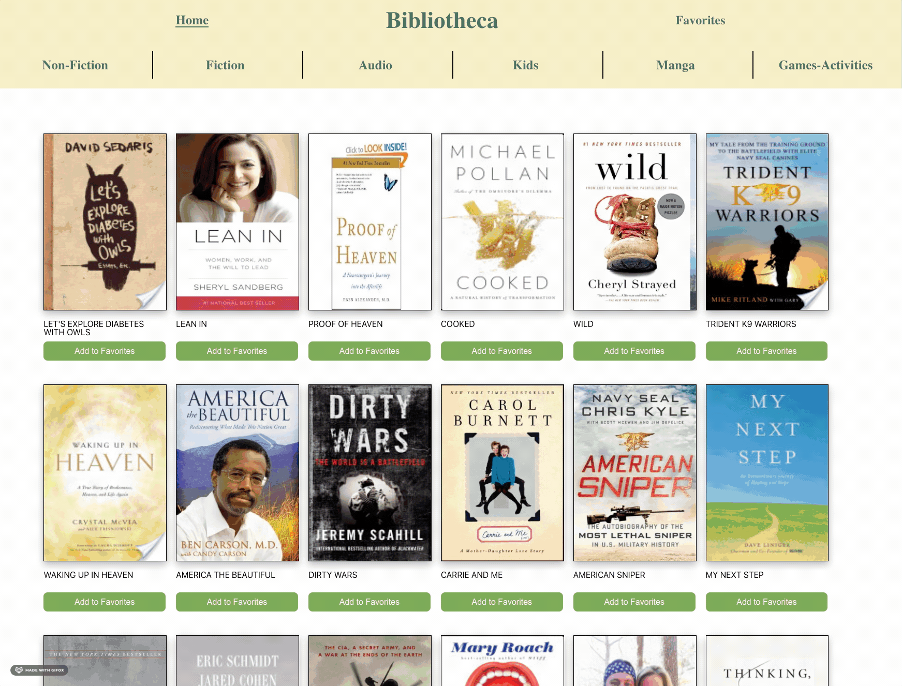
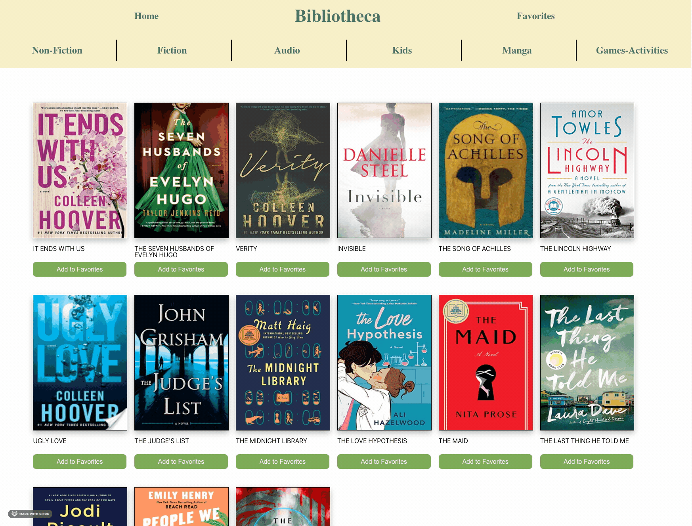

# Biblotheca 📖

### Turing FEE Final Solo Project 2108
[Deployed Project](https://inspiring-kilby-f14863.netlify.app/)

## Table of Contents
  - [Abstract](#Abstract)
  - [Technologies](#Technologies)
  - [Illustrations](#Illustrations)
  - [Wins](#Wins)
  - [Challenges](#Challenges)
  - [Additions](#Additions)
  - [Contributors](#Contributors)
  - [Specs](#Specs)

## Abstract
An app for book lovers! Love to read but don't know what new adventure to get your eyes on next ? Biblotheca is a website that will keep you up to date with all the best sellers. You can save all of your favorite books and always come back to them. See a book that interests you?  Click on the book cover and the book details are displayed along with a link to where to buy that new book that you loved.

## Technologies
     
    

## Illustrations

### Home page view
  

### Caterogy search display

### Favoriting functionality

## Wins
- Populating data from api endpoints
- Making fetch url dynamic according to what category is chosen
- Implement propTypes

## Challenges
- Working with an API with a daily request quota proved difficult with constant testing and debugging
- Re-rendering the books list on router path change.

## Additions
- Allow the user to input the name of an author, a category, or the title of a book in a search bar and get new books based on that.
- Adding a login function

## Contributors
[Ricardo Tovar](https://github.com/JRicardoT) 

## Specs
[Showcase Project](https://frontend.turing.edu/projects/module-3/showcase.html)
